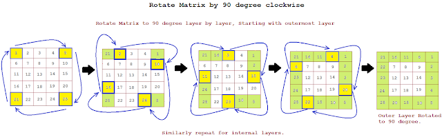

# Rotate Image
---

## Problem Description

Given an `n x n` 2D matrix representing an image, rotate the matrix **90 degrees clockwise** in place.

**Note:** You must rotate the matrix in place without using extra space for another matrix.

---

## Solution Approach

### Algorithm Overview

The key insight is to process the matrix layer by layer from the outside towards the center. For each layer, we rotate elements in groups of 4 by moving them in a circular pattern:

1. **Identify layers:** For an `n x n` matrix, we need to process `n/2` layers
2. **For each layer:**
   - Define `first` (start index) and `last` (end index) of the current layer
   - Iterate through positions in the top row of the layer
   - For each position, swap 4 elements in a circular rotation pattern:
     - **Top** → **Right**
     - **Right** → **Bottom**
     - **Bottom** → **Left**
     - **Left** → **Top**

### Visual Explanation

```
Starting Points Position (Corners of each layer)
----------------
| C1 |    | C2 |
----------------
|    |    |    |
----------------
| C4 |    | C3 |
----------------

Moving Directions (How elements rotate)
-----------------
| ➡️ |    | ⬇️ |
-----------------
|    |    |    |
-----------------
| ⬆️ |    | ⬅️ |
-----------------
```



### Step-by-Step Process

For a 4×4 matrix, rotating layer 0:
- Element at `(0, 0)` gets value from `(3, 0)`
- Element at `(3, 0)` gets value from `(3, 3)`
- Element at `(3, 3)` gets value from `(0, 3)`
- Element at `(0, 3)` gets value from `(0, 0)`
- And so on for each position in that layer...

---

## Key Points

- **Time Complexity:** `O(n²)` - We visit each element exactly once
- **Space Complexity:** `O(1)` - Only a constant amount of extra space for variables (in-place rotation)
- **Approach:** Layer-by-layer rotation with circular element swapping

---

## Java Code

```java
class Solution {
    /*
        >> Starting Points Position
            ----------------
            | C1 |    | C2 |
            ----------------
            |    |    |    |
            ----------------
            | C4 |    | C3 |
            ----------------

        >> Moving Directions
            -----------------
            | ➡️ |    | ⬇️ |
            -----------------
            |    |    |    |
            -----------------
            | ⬆️ |    | ⬅️ |
            -----------------
    */

    public static void rotate(int[][] matrix) {
        int n = matrix.length;

        // Process each layer from outside to inside
        for (int layer = 0; layer < n / 2; layer++) {
            int first = layer;
            int last = n - 1 - layer;

            // Rotate elements within the current layer
            for (int i = first; i < last; i++) {
                int offset = i - first;
                
                // Save top element
                int top = matrix[first][i];
                
                // Move left → top
                matrix[first][i] = matrix[last - offset][first];
                
                // Move bottom → left
                matrix[last - offset][first] = matrix[last][last - offset];
                
                // Move right → bottom
                matrix[last][last - offset] = matrix[i][last];
                
                // Move top → right
                matrix[i][last] = top;
            }
        }
    }
}
```


